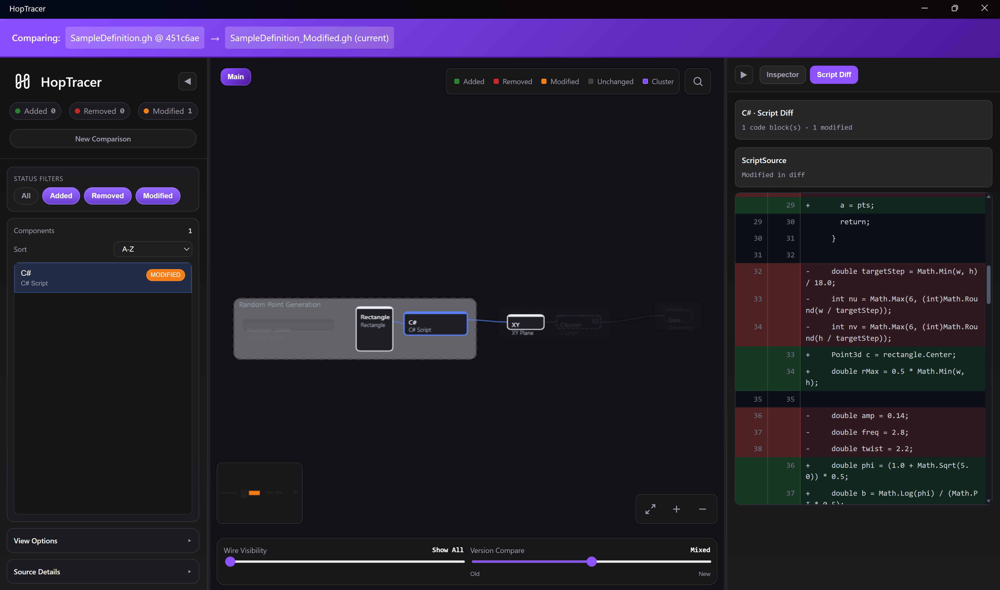

<p align="center">
  
</p>

# HopTracer

[](https://opensource.org/licenses/MIT)
[](https://dotnet.microsoft.com/)
[](https://www.microsoft.com/windows)
[](https://github.com/lasaths/HopTracer/actions/workflows/build.yml)
[](https://github.com/lasaths/HopTracer/releases)

HopTracer is a Windows desktop diff tool for Grasshopper definitions (`.gh`, `.ghx`).
It compares two versions, renders an interactive graph diff, and surfaces risk-focused change diagnostics for review.

<p align="center">
  
</p>

## What Works Today

### Input and Compare Flows
- Start screen supports drag-and-drop at launch for both **OLD** and **NEW** files.
- Native file picker support for local path-based workflows.
- Accepts both `.ghx` and `.gh`.
- Compares:
  - file vs file
  - file vs Git commit
  - commit vs commit (via source selection in diff flow)
- File validation enforces extension and size constraints (100 MB upload limit in compare endpoint).

### Diff Engine
- Node statuses: `same`, `added`, `removed`, `modified`.
- Edge statuses: `same`, `added`, `removed`.
- Port-level diffs:
  - added/removed/modified ports
  - value change tracking (`ValueOld`, `ValueNew`, `ValueChanged`)
  - wire display mode propagation
- Connection change accounting per node:
  - `InAdded`, `InRemoved`, `OutAdded`, `OutRemoved`
- Fallback node identity matching when GUIDs churn:
  - name/nickname, topology, port schema, distance, and metadata heuristics
- Edge identity normalization avoids false wire diffs from token formatting differences:
  - case-insensitive handling
  - `{GUID}` vs `GUID` normalization
- Movement tolerance guardrail:
  - deltas below `0.05` are normalized to zero
- Risk scoring with reasons and summary buckets:
  - critical/high/medium/low summary
  - top-risk node list
  - invariant: `modified` nodes are emitted with non-zero risk

### Parser and Data Extraction
- Parses `.ghx` object graphs into nodes/edges with geometry and metadata.
- `.gh` conversion to `.ghx` using `GH_IO.dll` (reflection-based loading).
- Extracts common component properties including values and script-like fields.
- Parses both modern and legacy parameter schemas (`InputParam/OutputParam`, `param_input/param_output`).
- Group extraction:
  - group node detection
  - member list extraction (`GroupMemberIds`)
- Cluster support:
  - cluster payload detection
  - hash and size extraction
  - recursive cluster preview graph extraction with limits
  - cluster diagnostics (parsed/failed/depth-limited counters)

### Review and Reporting
- Forensic report export (JSON + HTML) from the diff viewer.
- Baseline compare workflow with pass/fail risk gating.

### CLI (`hoptracer`)
- Compare two `.gh`/`.ghx` files or diff against a Git commit from the terminal.
- Output formats: `text`, `markdown`, `json`, `html`, and `agent` (AI-oriented JSON with resolved wire labels).
- Review workflows: `doctor`, `baseline save|list|compare`, `report` (forensic JSON + HTML).
- Shipped in portable releases at `tools/hoptracer/hoptracer.exe`; on PATH after Microsoft Store install.
- Agent skill: `npx skills add lasaths/HopTracer@hoptracer -g -y` (see [`skills/hoptracer/SKILL.md`](skills/hoptracer/SKILL.md)).

### Diff Viewer (Web UI inside Desktop App)
- Interactive canvas:
  - pan, zoom, fit-to-view
  - minimap
  - node/edge coloring by status
- Left panel:
  - search
  - status filters (`all`, `added`, `removed`, `modified`)
  - component list sorting:
    - A-Z
    - Z-A
    - distance from origin
    - data size (with fallback property-size estimation)
  - optional visibility toggles for ports and groups
- Bottom controls:
  - wire visibility threshold slider
  - old/new version interpolation slider
- Inspector panel:
  - component metadata
  - connection deltas
  - movement delta
  - risk score/reasons
  - component property value comparisons
- Script Diff tab for script-capable nodes.
- Cluster internals preview tab with internal graph diff rendering.
- Source picker modal in diff view:
  - swap old/new source by file or Git commit.
- Large-model handling:
  - chunked normalization/loading
  - viewport culling mode with performance indicator

### Git and Review Features
- Git integration:
  - detect repository status
  - list commits touching a file (`--follow`)
  - retrieve file content at selected commit
  - commit metadata includes author, age, and file size
- Baseline workflows (API):
  - save baseline snapshot
  - compare against baseline using fingerprint + risk summary
- Forensic report generation (API):
  - signed JSON report
  - HTML report artifact
  - includes diagnostics and top risks

### Desktop Host and Packaging
- .NET MAUI host app with embedded ASP.NET Core backend + WebView.
- Embedded static web assets for portable deployment.
- Self-contained portable Windows publish output.
- Microsoft Store/MSIX build scripts and readiness checks included.
- Startup update check against latest GitHub release (cached).

## Current Gaps / Missing Pieces

- Official build/distribution path is Windows-focused (MAUI project currently targets Windows in active config).
- Full `.gh` conversion and best-effort cluster archive decoding depend on `GH_IO.dll` availability.
- Cluster internals can still be unavailable for some archives/environments (diagnostics are surfaced when this happens).

## Installation

1. Download the latest release from the [Releases](https://github.com/lasaths/HopTracer/releases) page.
2. Extract `HopTracer-Windows-x64.zip`.
3. (Optional) Run `Install-ExplorerMenu.ps1` in `HopTracer_Portable` to add **Convert to GHX (HopTracer)** to `.gh` file right-click menus.
4. Run `HopTracer.exe` from `HopTracer_Portable`.

To remove the context-menu entry later, run `Uninstall-ExplorerMenu.ps1` from the same folder.

No separate .NET runtime installation is required for release builds.

### Dependency: `GH_IO.dll`

`GH_IO.dll` is required for:
- `.gh` to `.ghx` conversion
- enhanced cluster archive decoding paths

It is not required for plain `.ghx`-only comparisons.

To provision it automatically:

```powershell
.\scripts\setup_dependencies.ps1
```

Script search locations:
- `C:\Program Files\Rhino 8\Plug-ins\Grasshopper\GH_IO.dll`
- `C:\Program Files\Rhino 7\Plug-ins\Grasshopper\GH_IO.dll`
- `C:\Program Files\Rhino 6\Plug-ins\Grasshopper\GH_IO.dll`

## Usage

1. Launch `HopTracer.exe`.
2. At startup, select files using either:
   - drag and drop, or
   - click each drop zone for native file picker.
3. (Optional) For old-file Git workflows, choose from Git history.
4. Click **Compare Files**.
5. Explore results:
   - filter/search/sort components
   - click nodes for details, script diff, and cluster internals
   - use wire/version sliders for visual analysis

## Build From Source

### Prerequisites
- .NET 10 SDK
- Visual Studio 2022 (17.12+) or VS Code
- Windows 10/11
- Rhino 7/8 optional (or manual `GH_IO.dll`) for `.gh` conversion support

### Release Preflight

Validate the shared release gate before packaging:

```powershell
.\scripts\check_store_readiness.ps1
```

For a Store-ready signed build, pass the reserved identity, publisher, and certificate inputs:

```powershell
.\scripts\check_store_readiness.ps1 `
  -Strict `
  -ExpectedIdentityName "com.hoptracer.app" `
  -ExpectedPublisher "CN=HopTracer" `
  -ExpectedPackageVersion "1.0.0.1" `
  -CertificatePath "C:\path\store-signing-cert.pfx" `
  -CertificatePassword "..."
```

### Local Build

```powershell
.\scripts\build.ps1
```

Options:
- `-SkipClean`
- `-SkipTests`

Outputs:
- `Release\HopTracer_Portable\`
- `Release\HopTracer-Windows-x64.zip`

### Microsoft Store / MSIX

```powershell
.\scripts\build_msix.ps1 `
  -IdentityName "com.hoptracer.app" `
  -Publisher "CN=HopTracer"
```

Optional strict readiness check:

```powershell
.\scripts\build_msix.ps1 `
  -RequireStoreReadiness `
  -IdentityName "com.hoptracer.app" `
  -Publisher "CN=HopTracer" `
  -PackageVersion "1.0.0.1" `
  -CertificatePath "C:\path\store-signing-cert.pfx" `
  -CertificatePassword "..."
```

For a `1.0.0` reissue, keep `-Version "1.0.0"` and only increment the fourth `-PackageVersion` component if `1.0.0.0` has already been submitted to Microsoft Store.

Store documentation:
- [`docs/MICROSOFT_STORE.md`](docs/MICROSOFT_STORE.md)

## Architecture Overview

- `Source/HopTracer`:
  - MAUI desktop host
  - launches embedded ASP.NET Core server
  - hosts viewer in WebView
- `Source/HopTracer.Web`:
  - controllers and static web UI (`index.html`, `diff_viewer.html`)
  - compare, git, review/baseline/report endpoints
- `Source/HopTracer.Core`:
  - parser (`GhxParser`)
  - diff engine (`Differ`)
  - Git wrapper (`GitWrapper`)
  - conversion (`ConverterService`)
- `Tests/HopTracer.UnitTests`:
  - parser, differ, and validation tests

## API Surface (Internal App Endpoints)

- Compare:
  - `POST /compare`
- Git:
  - `POST /git/check`
  - `POST /git/commits`
  - `POST /git/compare`
  - `POST /git/view_diff`
  - `POST /git/file_info`
- File picker:
  - `GET /api/filepicker/pick-native-file`
  - `GET /api/filepicker/last-file-path`
  - `POST /api/filepicker/capture-file-path`
- Review:
  - `POST /review/baseline/save`
  - `POST /review/baseline/compare`
  - `POST /review/report/forensic`
  - `POST /review/report/from_diff`
- System:
  - `GET /system/dependency_health`
  - `POST /system/pick_file`

## Quality and Tests

Current unit test coverage includes:
- parser behavior (bounds, legacy params, cluster preview, group extraction)
- diff behavior (property/connection/cluster changes, identity fallback, risk guardrails)
- file validation behavior (path validation and sanitization)

Run tests:

```powershell
dotnet test Tests/HopTracer.UnitTests/HopTracer.UnitTests.csproj
```

## Contributing and Policies

- Contributing: [CONTRIBUTING.md](CONTRIBUTING.md)
- Code of Conduct: [CODE_OF_CONDUCT.md](CODE_OF_CONDUCT.md)
- Security: [SECURITY.md](SECURITY.md)
- Changelog: [CHANGELOG.md](CHANGELOG.md)
- Privacy policy: [docs/privacy.md](docs/privacy.md) (Store URL: https://github.com/lasaths/HopTracer/blob/main/docs/privacy.md)
- Microsoft Store: [docs/MICROSOFT_STORE.md](docs/MICROSOFT_STORE.md)

## License

MIT License. See [LICENSE](LICENSE).

## Credits

- Built with [.NET MAUI](https://dotnet.microsoft.com/apps/maui) and [ASP.NET Core](https://dotnet.microsoft.com/apps/aspnet)
- GH/GHX conversion approach based on [GhToGhx](https://bitbucket.org/rilgh/ghtoghx/wiki/Home)
- Development, documentation, and Store assets were created with the assistance of AI (GitHub Copilot), with maintainer review

